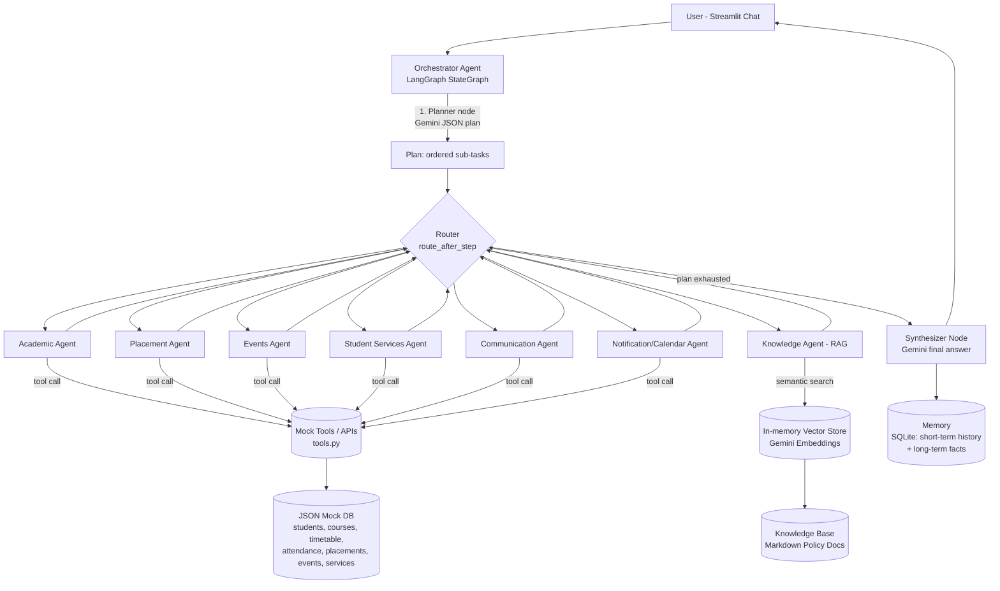

# Architecture — Smart Campus Multi-Agent AI System

## Component notes

- **Orchestrator Agent (LangGraph)**: a `StateGraph` with a `planner` node, one node per specialized agent, and a `synthesizer` node. A shared `route_after_step` function inspects the remaining plan and directs control flow, so the graph dynamically visits only the agents a given request actually needs.
- **Planner**: single Gemini call (JSON-constrained output) that decomposes the user request into an ordered list of `{agent, task}` steps, using the last 6 turns of chat history and the student's long-term facts for context.
- **Specialized agents**: each agent gets a small, fixed menu of tools relevant to its domain, asks Gemini which tool + arguments fit its sub-task (explicit function-calling step), executes the mock tool, then summarizes the result in natural language.
- **Knowledge Agent (RAG)**: markdown policy documents are chunked, embedded once with Gemini's embedding model, cached to disk, and retrieved via in-memory cosine similarity — no external vector DB required for the demo, but swappable for FAISS/Chroma/Pinecone later.
- **Memory**: SQLite-backed. Short-term = recent conversation turns (context-aware conversation). Long-term = durable per-student facts that persist across sessions (stretch goal).
- **Mock Tools / APIs**: simulate the calendar, email, registration, and database layer over local JSON files, standing in for real institutional systems per the hackathon brief.
- **Synthesizer**: combines all step results into one coherent, user-facing answer and writes the turn to memory.
